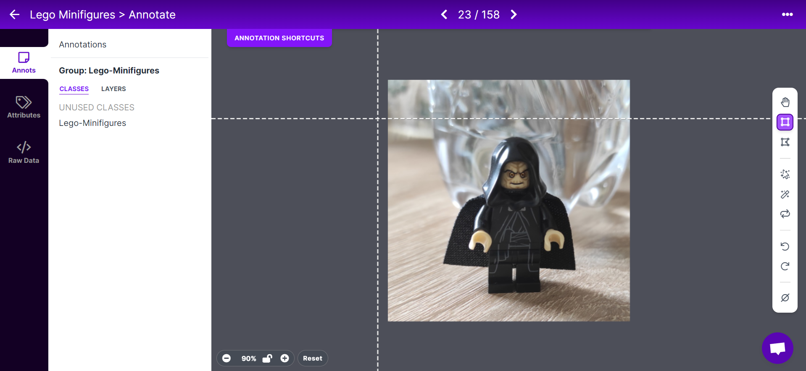

# Detección de figuras de Lego Minifigures con YOLOv7

Se ha realizado un detector de figuras de Lego con la motivación de comprobar la capacidad que tiene YOLOv7.

---
### Contenido

[Procedimiento](#procedimiento)

[Fuentes utilizadas](#fuentes-utilizadas)

[Resultados](#resultados)

[Autores](#autores)

---

## Procedimiento

En primer lugar, se realizó la búsqueda de un dataset que contuviese figuras de Lego. Éste se encontró en [Kaggle](https://www.kaggle.com/). A continuación, se utilizó la herramienta ofrecida por [Roboflow](https://universe.roboflow.com/) para anotarlas y, una vez hecho tal acción, se dividó el dataset para entrenamiento, validación y test. Se utilizó un 70% de las imágenes para el entramiento, 20% de validación y 10% de test.

Seguidamente, se siguió el guión de la práctica ofrecido por [Modesto Fernando Castrillón Santana](https://github.com/otsedom/otsedom.github.io/tree/main/VC/P7) para la instalación del repositorio y su posterior uso.

Tras ello, se realizó el entrenamiento utilizando los parámetros sugeridos en el guión antes nombrado. Una vez la red finalizó el entrenamiento, se evaluó y se estudiaron los resultados. Con los valores del tamaño del batch y el número de épocas originales, prácticamente no detectaba ninguna figura. Así que se decidió aumentar el número de épocas a 50. Esto provocó una mejora considerable con respecto al entrenamiento original, sin embargo, era mejorable.

Es entonces cuando se decidió aumentar un poco más el dataset con figuras de legos más variadas, ya que la mayoría eran imágenes de Lego Star Wars y podría influenciar a los resultados. Por ello, se añadieron fotografías de Lego Marvel. Tras esta acción, no se estaba conforme con los resultados, así que se volvió a aumentar el batch a 16 y las épocas a 90.

Finalmente, los resultados obtenidos del último entrenamiento descrito fueron satisfactorios.

## Resultados

Entrenamiento:

[Vídeo de evaluación del entrenamiento]()

Tras lo descrito en el procedimiento, se puede concluir:

- La elección del dataset es crucial. Mientras mayor y más variado sea, mejor será el resultado obtenido.

- Aumentar el número de épocas y de batch podría mejorar efecto del entrenamiento. Sin embargo, esta estrategia también puede ser peligrosa, ya que podría dar Overfitting, además de que también incrementa considerablemente el tiempo de entrenamiento.

- No es perfecto, ya que, en ocasiones, hay falsos positivos. Suele marcar como figura los elementos que sostinen las Lego Minifigures (como las espadas laser, pistolas...) u otros elementos de Lego que no son las figuras.

## Fuentes utilizadas

- [Dataset de Lego Minifigures](https://www.kaggle.com/datasets/ihelon/lego-minifigures-classification)

- [Anotación de los Lego Minifigures](https://universe.roboflow.com/vc-echpj/lego-minifigures-r3zzt/dataset/1)

- [Notebook de Google Colab en el que se ha basado el de este proyecto](https://colab.research.google.com/drive/1X9A8odmK4k6l26NDviiT6dd6TgR-piOa#scrollTo=0W0MpUaTCJro)

## Autores

- [María Naranjo Almeida](https://github.com/marianaral)

- [Alberto Melián Rodríguez](https://github.com/Aeronpsaro)