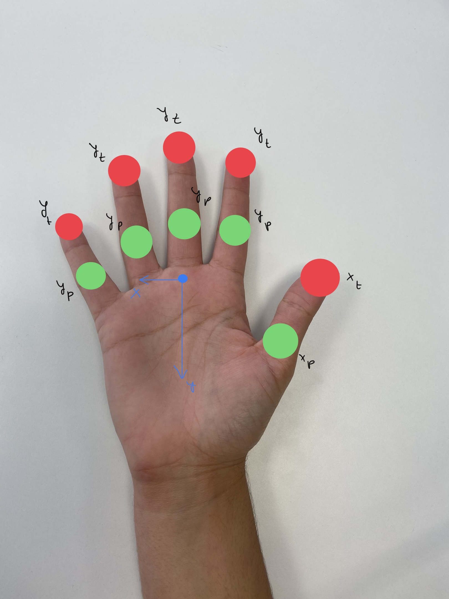

# Trabajo del Curso de la asignatura de Visión por Computador - Pictionary


En este proyecto consiste en una implementación del conocido juego de Pictionary utilizando la visión por computador.

 ---

### Índice

[Motivación](#motivación)

[Objetivo](#objetivo)

[Controles](#controles)

[Guía de instalación](#guía-de-instalación)

[Descripción técnica](#descripción-técnica)

[Fuentes y tecnologías utilizadas](#fuentes-y-tecnologías-utilizadas)

[Conclusiones](#conclusiones)

[Propuesta de ampliación y posibles mejoras](#propuesta-de-ampliación-y-posibles-mejoras)

[Créditos materiales no originales](#créditos-de-materiales-no-originales)

[Autores](#autores)

 ---
 
## Motivación

Durante la época de navidad, los amigos y las familias se reúnen para pasar las fiestas. Sin embargo, en ocasiones ocurre que hay silencios incómodos o tardes aburridas por falta de actividades que hacer en conjunto. Es por ello que hemos desarrollado este juego del Pictionary, mediante el cual, con solamente un ordenador y un televisor, todos los asistentes pueden pasar una tarde entretenida y accesible para todas las edades.

## Objetivo

El principal objetivo de este proyecto es que los usuarios que lo utilicen, puedan dibujar libremente, de manera fácil e intuitiva. Además de familiarizarse con la librería de Mediapipe, en concreto, usar la detección de manos para poder usar gestos intuitivos.

## Controles

Para aprovechar todas las posibilidades que ofrece este programa, es necesario conocer los controles:

1. Para poder dibujar, se tiene que utilizar la mano derecha. A continuación se levantan uno o varios dedos. Según el número de dedos que se levanten, el grosor del trazo será mayor o menor. Si se cierra la mano derecha, no se dibujará ningún trazo.

2. Para borrar partes del dibujo, se usa la mano izquierda cerrada, moviéndola a través la zona a eliminar.

3. Para borrar el dibujo entero se enseña el pulgar arriba de la mano izquierda.

4. Para cambiar el color de lo que se dibuja, se levanta el dedo índice de la mano izquierda y se mueve horizontalmente. Cuando se ha encontrado el color deseado se cierra la mano.

5. Para cerrar la cámara hay que pulsar el botón «Esc».


## Guía de instalación

Se crea un entorno de conda apropiado.

```
conda create --name pictionary python==3.9
conda activate pictionary
```

Se instalan todas las librerías necesarias para la realización del proyecto.

```
pip install mediapipe 
pip install opencv-python
```
Tras las instrucciones anteriores, ya se tiene listo el entorno para ejecutar el programa.

## Descripción técnica

Una vez listo el entorno con las librerías necesarias, primero hay que importar las librerías e iniciar la cámara del equipo, como se ha hecho en proyectos anteriores.

```
import cv2
import mediapipe as mp
import numpy as np

vid = cv2.VideoCapture(0)

while(True): 
    ret, frame = vid.read()
    
    #Se hace flip del frame para hacer efecto espejo
    frame = cv2.flip(frame,1)
 
    cv2.imshow("Pictionary", frame)
    cv2.waitKey(1)

    # Detenemos pulsado ESC
    if cv2.waitKey(20) == 27:
         break
  
# Libera el objeto de captura
vid.release()
# Destruye ventanas
cv2.destroyAllWindows()
```

El siguiente paso consiste en utilizar la librería Mediapipe para la detección de manos. Han de inicializarse las siguientes variables básicas:

```
mpHands = mp.solutions.hands
hands = mpHands.Hands()
mpDraw = mp.solutions.drawing_utils
```

Además, existe una variable de configuración (MAX_NUM_HANDS) que permite establecer el número máximo de manos que se detectan. Por defecto son dos, que es lo deseado y, por lo tanto, no se ha tenido que modificar.

Seguidamente, en el bucle de la cámara, tenemos que utilizar el fotograma actual como imagen para que la librería Mediapipe la procese y detecte las manos. El objeto de Mediapipe que contiene toda la información del procesamiento de las manos se almacena en la variable _results_.

```
imageRGB = cv2.cvtColor(frame, cv2.COLOR_BGR2RGB)
results = hands.process(imageRGB)
```

Lo siguiente que se desea hacer es utilizar la información obtenida de las manos. Es por ello que se ha utilizado el atributo _multi_hand_landmarks_ del objeto _results_. Los landmarks o puntos de referencia de la mano corresponden a la localización de los 21 puntos importantes de la mano, según ha definido Mediapipe. Estos landmarks son:

||
|:--:|
|Imagen obtenida de la [documentación oficial](https://google.github.io/mediapipe/solutions/hands)|

Con esa información ya se conocen las coordenadas normalizadas de los landmarks. Además, para conocer si la mano que se está mostrando es la derecha o la izquierda, hay que usar otro atributo del objeto _results_ denominado _multi_handedness_, el cual tiene dos propiedades: la etiqueta o label que indica si la mano es la derecha o la izquierda y el score o puntuación que informa sobre la probabilidad de que lo detectado sea una mano.

Se procede a la utilización de estos datos para saber si tenemos alguna mano en el fotograma o no, comprobando que exista _results.multi_hand_landmarks_. Con tal información, se puede saber si tenemos la mano cerrada o abierta y cuantos dedos están abiertos. 

De esta manera, se ha desarrollado la función denominada _countFingers()_, que toma como parámetros de entrada los landmarks y a qué mano corresponden dichos landmarks (``` results.multi_handedness[0].classification[0].label ```). Esta función devuelve un array con las coordenadas x, y de la parte de la mano a trackear (se explicará a qué hace referencia esto más adelante) y cuántos dedos está mostrando.

Para obtener la cuenta de los dedos mostrados, hay que analizar los landmarks de cada uno. Como se puede ver en las imágenes siguientes, cuando una mano se cierra, la posición de la punta de los dedos y<sub>t</sub> cambia en el sentido de las y, mientras que la articulación que une la falange proximal con la media del dedo (articulación interfalangiana) y<sub>p</sub> se mantiene, aproximadamente, en la misma posición en y. Es por ello que para conocer cuántos dedos hay abiertos, hay que comparar si la posición en y de la punta del dedo está por encima (abierto) o por debajo (cerrado) de la articulación nombrada.

Lo descrito anteriormente es cierto en los casos de los dedos, pero no de los pulgares. Estos no se cierran verticalmente, sino horizontalmente, por lo que hay que comprobar si la posición en x de la punta del pulgar está a la derecha o a la izquierda de la articulación que une el metacarpiano con la primera falange (articulación metacarpofalángica). Además, según la mano en la que sea, si la punta está más hacia la derecha puede significar que el dedo está abierto (mano derecha) o cerrado (dedo izquierdo).

||
|:--:|
|Imagen de la mano derecha abierta con los puntos a comparar|

||
|:--:|
|Imágenes de la mano derecha cerrada con los puntos a comparar|

||
|:--:|
|Imagen de la mano izquierda abierta con los puntos a comparar|

||
|:--:|
|Imágenes de la mano izquierda cerrada con los puntos a comparar|

La parte de la mano a seguir hace referencia a que si se está usando la mano derecha y se quiere pintar, se utilizará la posición (x, y) de la punta del dedo índice (INDEX_FINGER_TIP) para formar el trazo, como si se tratase la punta de un lápiz o pincel. Con tal información, se marca con un 1 la posición (x, y) de la matriz denominada _drawn_, que tiene las mismas dimensiones del frame. Con esta estructura se define por qué pixels ha pasado el dedo  y, por lo tanto, se ha querido pintar. En adición, con la información del número de dedos mostrados, se marca dicha cuenta en la posición (x,y) de la matriz _thickness_, también de las mismas dimensiones del frame. Esta estructura informa sobre qué grosor hay que utilizar para dibujar el trazo. A mayor número de dedos mostrados, más grueso es.

Para la mano izquierda existen tres posibles acciones:

- Borrar: si no se muestra ningún dedo, y por lo tanto se cierra el puño, se toma la articulación interfalangiana del dedo corazón (mpHands.HandLandmark.MIDDLE_FINGER_PIP) como si se tratase de una goma. Con su posición (x,y), se marca con un 0 en la posición (x,y) de la matriz _drawn_, para indicar que ahí no hay que dibujar. Sin embargo, tras la realización de diversas pruebas, se concluyó que al ser la coincidencia con un pixel exacto es muy complicado, se marcan a 0 los 20 píxeles a izquierda y derecha y arriba y abajo del punto (x,y), formándose una goma de 40x40. 

- Borrar todo: si todos los dedos de la mano izquierda menos el pulgar están cerrados y el pulgar está más arriba por una cierta altura umbral de su articulación interfalangiana y la del dedo índice (si no se activaría esta acción al cerrar la mano) se borra la escena entera, retornando a los valores de inicio.

- Para cambiar de color: si se muestra algún dedo (independientemente de cuál sea), se toman las coordenadas en x de la punta del dedo índice para seleccionar un color. Para obtener el color, se llama a una función denominada _ObtainColor_, la cual normaliza la posición en x en un valor dentro del rango [0,255] y lo mapea entre rojo y azul.

Una vez analizados las manos y los dedos e insertados los valores en las estructuras de datos correspondientes, se obtienen los índices de la matriz _drawn_ distintos de 0, es decir, las coordenadas por las que el dedo índice de la mano derecha ha pasado para pintar y se almacenan en un array.

```
arr = np.transpose((drawn > 0).nonzero())
```

Finalmente, se recorre _arr_ y se pinta un círculo en las posiciones (arr[i][0], arr[i][1]), donde arr[i][0] es la posición x del elemento i, y arr[i][1] es la coordenada y del elemento i; con un grosor de 4 * thickness[arr[i][0], arr[i][1]].

```
for i in range(len(arr)):
	cv2.circle(frame, (arr[i][0], arr[i][1]), 4 * int(thicknes[arr[i][0], arr[i][1]]) , ObtainColorFromPosition(arr[i][0],arr[i][1]), cv2.FILLED)
```

La tríada del color se obtiene de la función _ObtainColorFromPosition_, que accede a las tres matrices de color de la escena en los índices que se le pasan.

## Fuentes y tecnologías utilizadas

- [Conda](https://docs.conda.io/en/latest/)

- [Mediapipe](https://mediapipe.dev/)

- [OpenCV](https://opencv.org/)

- [Guiones de las prácticas de la asignatura](https://github.com/otsedom/otsedom.github.io/tree/main/VC)

- [Partes de una mano](https://enfermeria.top/apuntes/anatomia/miembro-superior/articulaciones/#ligamentos-8)

## Conclusiones

Mediapipe es una herramienta muy potente para el seguimiento de las manos y obtener sus gestos y sus aplicaciones pueden ser muy variadas. Estas van desde crear un juego sencillo hasta poder tener un traductor de lengua de signos. Cabe destacar que la herramienta dispone de un abanico de posibilidades mucho más amplio del explorado, como detección y seguimiento de iris, de la pose del cuerpo humano...


## Propuesta de ampliación y posibles mejoras

Una vez analizada la capacidad de la aplicación, se han considerado de interés para el desarrollo posterior las siguientes ampliaciones y mejoras:

- Incluir el proyecto en una aplicación de realidad aumentada, donde los jugadores que tienen que adivinar lo que está dibujando otra persona que lo pueda ver desde su propio dispositivo móvil.

- Aumentar la fluidez del trazado.

- Usar diversos pinceles en función del gesto escogido.

- Dar la posibilidad al usuario de definir con qué mano desea dibujar.

- Permitir la utilización de ambas manos simultáneamente. En la versión actual del proyecto, si están las dos manos dentro del fotograma, tiene mayor preferencia la mano izquierda, con lo que mientras se muestre no se podrá dibujar, sino solo borrar y cambiar de color.

## Créditos de materiales no originales

- [Utilización de la librería Mediapipe para la detección de la mano](https://www.section.io/engineering-education/creating-a-hand-tracking-module/#:~:text=Hand%20tracking%20using%20MediaPipe%20involves%20two%20stages%3A%201,landmarks%20on%20the%20cropped%20image%20of%20the%20hand.)

- [Acceder al atributo label de multi_handedness de Mediapipe](https://stackoverflow.com/questions/67455791/mediapipe-python-link-landmark-with-handedness)


## Autores
[María Naranjo Almeida](https://github.com/marianaral)

[Alberto Melián Rodríguez](https://github.com/Aeronpsaro)
